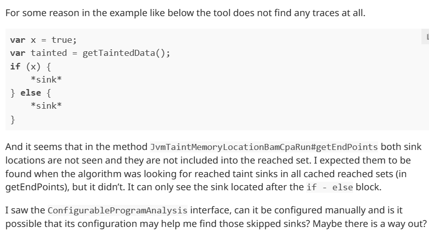

### Результаты запусков ProGuard-core

Тестовые файлы лежат в директории `src/proguard/proguard.sources`.

#### s1
На выходе получаем один трейс, хотя ветвей исполнения больше. Разработчики считают багом, вопрос открыт.

<details>
  <summary>Trace</summary>

```
JvmStackLocation(1)@Ls1/Class_0;class_0_method_4()Z:2844
JvmStackLocation(1)@Ls1/Class_0;class_0_method_4()Z:2841
JvmStackLocation(0)@Ls1/Class_0;class_0_method_4()Z:2840
JvmStackLocation(1)@Ls1/Class_0;class_0_method_4()Z:2837
JvmStackLocation(1)@Ls1/Class_0;class_0_method_4()Z:2834
JvmStackLocation(0)@Ls1/Class_0;class_0_method_4()Z:2833
JvmLocalVariableLocation(2)@Ls1/Class_0;class_0_method_4()Z:2832
JvmLocalVariableLocation(2)@Ls1/Class_0;class_0_method_4()Z:2448
JvmLocalVariableLocation(2)@Ls1/Class_0;class_0_method_4()Z:2445
JvmLocalVariableLocation(2)@Ls1/Class_0;class_0_method_4()Z:2443
JvmLocalVariableLocation(2)@Ls1/Class_0;class_0_method_4()Z:2440
JvmLocalVariableLocation(2)@Ls1/Class_0;class_0_method_4()Z:2438
JvmLocalVariableLocation(2)@Ls1/Class_0;class_0_method_4()Z:2435
JvmLocalVariableLocation(2)@Ls1/Class_0;class_0_method_4()Z:2432
JvmLocalVariableLocation(2)@Ls1/Class_0;class_0_method_4()Z:2429
JvmLocalVariableLocation(2)@Ls1/Class_0;class_0_method_4()Z:2421
JvmLocalVariableLocation(2)@Ls1/Class_0;class_0_method_4()Z:2418
JvmLocalVariableLocation(2)@Ls1/Class_0;class_0_method_4()Z:2416
JvmLocalVariableLocation(2)@Ls1/Class_0;class_0_method_4()Z:2413
JvmLocalVariableLocation(2)@Ls1/Class_0;class_0_method_4()Z:2291
JvmLocalVariableLocation(2)@Ls1/Class_0;class_0_method_4()Z:2288
JvmLocalVariableLocation(2)@Ls1/Class_0;class_0_method_4()Z:2280
JvmLocalVariableLocation(2)@Ls1/Class_0;class_0_method_4()Z:2277
JvmLocalVariableLocation(2)@Ls1/Class_0;class_0_method_4()Z:2275
JvmLocalVariableLocation(2)@Ls1/Class_0;class_0_method_4()Z:2272
JvmLocalVariableLocation(2)@Ls1/Class_0;class_0_method_4()Z:2270
JvmLocalVariableLocation(2)@Ls1/Class_0;class_0_method_4()Z:2267
JvmLocalVariableLocation(2)@Ls1/Class_0;class_0_method_4()Z:2265
JvmLocalVariableLocation(2)@Ls1/Class_0;class_0_method_4()Z:2262
JvmLocalVariableLocation(2)@Ls1/Class_0;class_0_method_4()Z:2233
JvmLocalVariableLocation(2)@Ls1/Class_0;class_0_method_4()Z:2230
JvmLocalVariableLocation(2)@Ls1/Class_0;class_0_method_4()Z:2190
JvmLocalVariableLocation(2)@Ls1/Class_0;class_0_method_4()Z:2187
JvmLocalVariableLocation(2)@Ls1/Class_0;class_0_method_4()Z:2185
JvmLocalVariableLocation(2)@Ls1/Class_0;class_0_method_4()Z:2182
JvmLocalVariableLocation(2)@Ls1/Class_0;class_0_method_4()Z:2180
JvmLocalVariableLocation(2)@Ls1/Class_0;class_0_method_4()Z:2177
JvmLocalVariableLocation(2)@Ls1/Class_0;class_0_method_4()Z:2164
JvmLocalVariableLocation(2)@Ls1/Class_0;class_0_method_4()Z:2161
JvmLocalVariableLocation(2)@Ls1/Class_0;class_0_method_4()Z:2153
JvmLocalVariableLocation(2)@Ls1/Class_0;class_0_method_4()Z:2150
JvmLocalVariableLocation(2)@Ls1/Class_0;class_0_method_4()Z:2148
JvmLocalVariableLocation(2)@Ls1/Class_0;class_0_method_4()Z:2145
JvmLocalVariableLocation(2)@Ls1/Class_0;class_0_method_4()Z:2142
JvmLocalVariableLocation(2)@Ls1/Class_0;class_0_method_4()Z:2139
JvmLocalVariableLocation(2)@Ls1/Class_0;class_0_method_4()Z:2137
JvmLocalVariableLocation(2)@Ls1/Class_0;class_0_method_4()Z:2134
JvmLocalVariableLocation(2)@Ls1/Class_0;class_0_method_4()Z:2131
JvmLocalVariableLocation(2)@Ls1/Class_0;class_0_method_4()Z:2128
JvmLocalVariableLocation(2)@Ls1/Class_0;class_0_method_4()Z:2126
JvmLocalVariableLocation(2)@Ls1/Class_0;class_0_method_4()Z:2123
JvmLocalVariableLocation(2)@Ls1/Class_0;class_0_method_4()Z:2121
JvmLocalVariableLocation(2)@Ls1/Class_0;class_0_method_4()Z:2118
JvmLocalVariableLocation(2)@Ls1/Class_0;class_0_method_4()Z:2115
JvmLocalVariableLocation(2)@Ls1/Class_0;class_0_method_4()Z:2112
JvmLocalVariableLocation(2)@Ls1/Class_0;class_0_method_4()Z:2109
JvmLocalVariableLocation(2)@Ls1/Class_0;class_0_method_4()Z:2106
JvmLocalVariableLocation(2)@Ls1/Class_0;class_0_method_4()Z:2103
JvmLocalVariableLocation(2)@Ls1/Class_0;class_0_method_4()Z:2100
JvmLocalVariableLocation(2)@Ls1/Class_0;class_0_method_4()Z:2098
JvmLocalVariableLocation(2)@Ls1/Class_0;class_0_method_4()Z:2095
JvmLocalVariableLocation(2)@Ls1/Class_0;class_0_method_4()Z:2093
JvmLocalVariableLocation(2)@Ls1/Class_0;class_0_method_4()Z:2090
JvmLocalVariableLocation(2)@Ls1/Class_0;class_0_method_4()Z:2087
JvmLocalVariableLocation(2)@Ls1/Class_0;class_0_method_4()Z:2084
JvmLocalVariableLocation(2)@Ls1/Class_0;class_0_method_4()Z:2055
JvmLocalVariableLocation(2)@Ls1/Class_0;class_0_method_4()Z:2052
JvmLocalVariableLocation(2)@Ls1/Class_0;class_0_method_4()Z:2050
JvmLocalVariableLocation(2)@Ls1/Class_0;class_0_method_4()Z:2047
JvmLocalVariableLocation(2)@Ls1/Class_0;class_0_method_4()Z:2045
JvmLocalVariableLocation(2)@Ls1/Class_0;class_0_method_4()Z:2042
JvmLocalVariableLocation(2)@Ls1/Class_0;class_0_method_4()Z:2039
JvmLocalVariableLocation(2)@Ls1/Class_0;class_0_method_4()Z:2036
JvmLocalVariableLocation(2)@Ls1/Class_0;class_0_method_4()Z:1590
JvmLocalVariableLocation(2)@Ls1/Class_0;class_0_method_4()Z:1587
JvmLocalVariableLocation(2)@Ls1/Class_0;class_0_method_4()Z:1514
JvmLocalVariableLocation(2)@Ls1/Class_0;class_0_method_4()Z:1511
JvmLocalVariableLocation(2)@Ls1/Class_0;class_0_method_4()Z:1509
JvmLocalVariableLocation(2)@Ls1/Class_0;class_0_method_4()Z:1506
JvmLocalVariableLocation(2)@Ls1/Class_0;class_0_method_4()Z:1504
JvmLocalVariableLocation(2)@Ls1/Class_0;class_0_method_4()Z:1501
JvmLocalVariableLocation(2)@Ls1/Class_0;class_0_method_4()Z:1498
JvmLocalVariableLocation(2)@Ls1/Class_0;class_0_method_4()Z:1495
JvmLocalVariableLocation(2)@Ls1/Class_0;class_0_method_4()Z:1492
JvmLocalVariableLocation(2)@Ls1/Class_0;class_0_method_4()Z:1489
JvmLocalVariableLocation(2)@Ls1/Class_0;class_0_method_4()Z:1487
JvmLocalVariableLocation(2)@Ls1/Class_0;class_0_method_4()Z:1484
JvmLocalVariableLocation(2)@Ls1/Class_0;class_0_method_4()Z:1482
JvmLocalVariableLocation(2)@Ls1/Class_0;class_0_method_4()Z:1479
JvmLocalVariableLocation(2)@Ls1/Class_0;class_0_method_4()Z:1476
JvmLocalVariableLocation(2)@Ls1/Class_0;class_0_method_4()Z:1473
JvmLocalVariableLocation(2)@Ls1/Class_0;class_0_method_4()Z:1460
JvmLocalVariableLocation(2)@Ls1/Class_0;class_0_method_4()Z:1457
JvmLocalVariableLocation(2)@Ls1/Class_0;class_0_method_4()Z:1455
JvmLocalVariableLocation(2)@Ls1/Class_0;class_0_method_4()Z:1452
JvmLocalVariableLocation(2)@Ls1/Class_0;class_0_method_4()Z:1449
JvmLocalVariableLocation(2)@Ls1/Class_0;class_0_method_4()Z:1446
JvmLocalVariableLocation(2)@Ls1/Class_0;class_0_method_4()Z:1433
JvmLocalVariableLocation(2)@Ls1/Class_0;class_0_method_4()Z:1430
JvmLocalVariableLocation(2)@Ls1/Class_0;class_0_method_4()Z:1427
JvmLocalVariableLocation(2)@Ls1/Class_0;class_0_method_4()Z:1424
JvmLocalVariableLocation(2)@Ls1/Class_0;class_0_method_4()Z:1394
JvmLocalVariableLocation(2)@Ls1/Class_0;class_0_method_4()Z:1391
JvmLocalVariableLocation(2)@Ls1/Class_0;class_0_method_4()Z:1389
JvmLocalVariableLocation(2)@Ls1/Class_0;class_0_method_4()Z:1386
JvmLocalVariableLocation(2)@Ls1/Class_0;class_0_method_4()Z:1383
JvmLocalVariableLocation(2)@Ls1/Class_0;class_0_method_4()Z:1380
JvmLocalVariableLocation(2)@Ls1/Class_0;class_0_method_4()Z:1377
JvmLocalVariableLocation(2)@Ls1/Class_0;class_0_method_4()Z:1374
JvmLocalVariableLocation(2)@Ls1/Class_0;class_0_method_4()Z:1193
JvmLocalVariableLocation(2)@Ls1/Class_0;class_0_method_4()Z:1190
JvmLocalVariableLocation(2)@Ls1/Class_0;class_0_method_4()Z:1188
JvmLocalVariableLocation(2)@Ls1/Class_0;class_0_method_4()Z:1185
JvmLocalVariableLocation(2)@Ls1/Class_0;class_0_method_4()Z:1183
JvmLocalVariableLocation(2)@Ls1/Class_0;class_0_method_4()Z:1180
JvmLocalVariableLocation(2)@Ls1/Class_0;class_0_method_4()Z:1177
JvmLocalVariableLocation(2)@Ls1/Class_0;class_0_method_4()Z:1174
JvmLocalVariableLocation(2)@Ls1/Class_0;class_0_method_4()Z:1172
JvmLocalVariableLocation(2)@Ls1/Class_0;class_0_method_4()Z:1169
JvmLocalVariableLocation(2)@Ls1/Class_0;class_0_method_4()Z:1166
JvmLocalVariableLocation(2)@Ls1/Class_0;class_0_method_4()Z:1163
JvmLocalVariableLocation(2)@Ls1/Class_0;class_0_method_4()Z:1161
JvmLocalVariableLocation(2)@Ls1/Class_0;class_0_method_4()Z:1158
JvmLocalVariableLocation(2)@Ls1/Class_0;class_0_method_4()Z:1156
JvmLocalVariableLocation(2)@Ls1/Class_0;class_0_method_4()Z:1153
JvmLocalVariableLocation(2)@Ls1/Class_0;class_0_method_4()Z:1150
JvmLocalVariableLocation(2)@Ls1/Class_0;class_0_method_4()Z:1147
JvmLocalVariableLocation(2)@Ls1/Class_0;class_0_method_4()Z:305
JvmLocalVariableLocation(2)@Ls1/Class_0;class_0_method_4()Z:302
JvmLocalVariableLocation(2)@Ls1/Class_0;class_0_method_4()Z:300
JvmLocalVariableLocation(2)@Ls1/Class_0;class_0_method_4()Z:297
JvmLocalVariableLocation(2)@Ls1/Class_0;class_0_method_4()Z:294
JvmLocalVariableLocation(2)@Ls1/Class_0;class_0_method_4()Z:291
JvmLocalVariableLocation(2)@Ls1/Class_0;class_0_method_4()Z:289
JvmLocalVariableLocation(2)@Ls1/Class_0;class_0_method_4()Z:286
JvmLocalVariableLocation(2)@Ls1/Class_0;class_0_method_4()Z:284
JvmLocalVariableLocation(2)@Ls1/Class_0;class_0_method_4()Z:281
JvmLocalVariableLocation(2)@Ls1/Class_0;class_0_method_4()Z:278
JvmLocalVariableLocation(2)@Ls1/Class_0;class_0_method_4()Z:275
JvmLocalVariableLocation(2)@Ls1/Class_0;class_0_method_4()Z:153
JvmLocalVariableLocation(2)@Ls1/Class_0;class_0_method_4()Z:150
JvmLocalVariableLocation(2)@Ls1/Class_0;class_0_method_4()Z:110
JvmLocalVariableLocation(2)@Ls1/Class_0;class_0_method_4()Z:107
JvmLocalVariableLocation(2)@Ls1/Class_0;class_0_method_4()Z:105
JvmLocalVariableLocation(2)@Ls1/Class_0;class_0_method_4()Z:102
JvmLocalVariableLocation(2)@Ls1/Class_0;class_0_method_4()Z:100
JvmLocalVariableLocation(2)@Ls1/Class_0;class_0_method_4()Z:97
JvmLocalVariableLocation(2)@Ls1/Class_0;class_0_method_4()Z:94
JvmLocalVariableLocation(2)@Ls1/Class_0;class_0_method_4()Z:91
JvmLocalVariableLocation(2)@Ls1/Class_0;class_0_method_4()Z:34
JvmLocalVariableLocation(2)@Ls1/Class_0;class_0_method_4()Z:31
JvmLocalVariableLocation(2)@Ls1/Class_0;class_0_method_4()Z:29
JvmLocalVariableLocation(2)@Ls1/Class_0;class_0_method_4()Z:26
JvmLocalVariableLocation(2)@Ls1/Class_0;class_0_method_4()Z:25
JvmLocalVariableLocation(2)@Ls1/Class_0;class_0_method_4()Z:22
JvmStackLocation(0)@Ls1/Class_0;class_0_method_4()Z:21
```
</details>

#### s2

Не выдает никаких трейсов, хотя должен выдать два и не видит sink-и внутри ифов. Вопрос открыт, ожидаю ответа от разработчиков.



#### s3

Тест на проход по цепочке методов. Должен быть один трейс.

<details>
  <summary>Trace</summary>

```
JvmStackLocation(1)@Ls3/Main;do_2()V:7
JvmStackLocation(1)@Ls3/Main;do_2()V:4
JvmStackLocation(0)@Ls3/Main;do_2()V:3
JvmStackLocation(0)@Ls3/Main;do_3()Ljava/nio/file/Path;:3
JvmStackLocation(0)@Ls3/Main;do_4()Ljava/nio/file/Path;:10
JvmStackLocation(1)@Ls3/Main;do_4()Ljava/nio/file/Path;:7
JvmStackLocation(1)@Ls3/Main;do_4()Ljava/nio/file/Path;:4
JvmStackLocation(0)@Ls3/Main;do_4()Ljava/nio/file/Path;:3
JvmStackLocation(0)@Ls3/Main;do_5()Ljava/lang/String;:3
JvmStackLocation(0)@Ls3/Main;do_6()Ljava/lang/String;:3
JvmStackLocation(0)@Ls3/Main;do_7()Ljava/lang/String;:3
JvmStackLocation(0)@Ls3/Main;do_8()Ljava/lang/String;:3
JvmStackLocation(0)@Ls3/Main;do_9()Ljava/lang/String;:3
JvmStackLocation(0)@Ls3/Main;do_10()Ljava/lang/String;:13
JvmStackLocation(0)@Ls3/Main;do_11(J)Ljava/lang/String;:4
JvmStackLocation(0)@Ls3/Main;do_12(J)Ljava/lang/String;:4
JvmStackLocation(0)@Ls3/Main;do_13(J)Ljava/lang/String;:4
```
</details>

### Общее по proguard

В отличие от UTBot-а смотрит на реальное возможное поведение программы. Т.е. например не подставляет искусственно значения в поля, если в реальном коде этого не происходит.  
Если есть потенциальное место, где какие-то данные меняются - будут создаваться assumptions и рассматриваться разные варианты исполнения.

[Ссылка](https://community.guardsquare.com/t/traces-interpretation/2393/4) на мой topic с обсуждением `trace`-ов.
